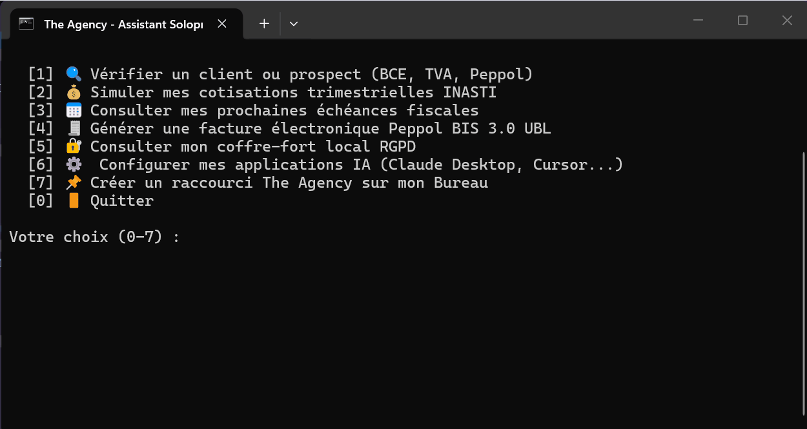

# The Agency 🇧🇪




> Boîte à outils de **skills et d'agents IA harness-agnostic** pour solopreneurs en Belgique.
> R&D, finance, admin, contenu, veille, secrétariat — tout ce qui mange le temps d'un indépendant,
> packagé en skills profonds, audités, et portables sur n'importe quel agent (Claude Code, Cursor,
> Hermes, Kilocode, Codex, …).

## Pourquoi ce repo

Un solopreneur belge passe un tiers de son temps sur l'administratif : TVA, INASTI, factures,
relances, veille, contenu. Ce repo transforme ce temps perdu en **workflows d'agent** :
des fichiers `SKILL.md` profonds (pas des prompts jetables), écrits une fois, utilisables
partout, sans dépendance à un outil propriétaire.

- **Harness-agnostic** : format [agentskills.io](https://agentskills.io/specification),
  frontmatter minimal portable, zéro clé spécifique à un éditeur.
- **Belgique d'abord** : BCE, TVA, INASTI, Peppol (obligatoire B2B depuis 2026), RGPD/APD,
  subsides VLAIO/Innoviris/SPW — avec marqueurs `as_of` et disclaimers.
- **Sécurité by design** : `scripts/security_scan.py` bloque secrets, chemins machine,
  injection de prompt, exfiltration. Zéro téléchargement exécuté. Voir [SECURITY.md](SECURITY.md).
- **Fraîcheur surveillée** : une CI mensuelle vérifie l'âge de chaque donnée réglementaire
  (`as_of`) et ouvre une issue quand un skill dépasse 6 mois sans revue.

📖 **[INDEX.md](INDEX.md)** — le catalogue complet des skills · 🎬 **[examples/](examples/)** — une journée de solopreneur orchestrée par l'agent

## Structure

```
The agency/
├── AGENTS.md                  # Instructions pour tout agent qui entre ici
├── SECURITY.md                # Règles non négociables (leaks, scraping, disclaimers)
├── INDEX.md                   # Catalogue des skills (généré — ne pas éditer à la main)
├── catalog.json               # Le même catalogue, machine-readable
├── agency/                    # ← Package Core, CLI Solopreneur & Vault RGPD local
├── mcp/                       # ← Serveur Model Context Protocol & APIs belges (agency-be-mcp)
│   ├── servers/agency_be/     #   13 outils, 3 resources, 2 prompts, guardrails
│   └── configs/               #   fichiers de config (Claude Code, Cursor, Hermes, Kilocode)
├── .agents/
│   ├── catalog_lite.json      #   catalogue léger Tier 1 (~2 300 tokens)
│   ├── schemas/               #   schémas A2A JSON v1 (quote_draft, contract_terms, invoice_event)
│   ├── workflows/             #   machine à états A2A (a2a_pipeline.md)
│   ├── skills/                # ← les skills (canonique)
│   └── agents/                # personas métier (dont `agency-operator`, l'orchestrateur)
├── adapters/
│   ├── link-skills.sh         # symlinks vers .claude/.cursor/.hermes/.kilocode
│   └── link-skills.ps1        # junctions Windows (sans droits admin)
├── evals/                     # ← Suite EDD : 40 cas d'or réglementaires belges & runner
├── scripts/
│   ├── validate_skills.py     # validation structurelle (frontmatter, sections, disclaimer)
│   ├── security_scan.py       # scan anti-leak (secrets, chemins, injection, exfiltration)
│   ├── check_related_links.py # vérifie que tous les related_skills résolvent
│   ├── build_index.py         # régénère INDEX.md + catalog.json (--check pour la CI)
│   ├── build_bce_index.py     # indexation locale KBO / BCE Open Data SQLite
│   ├── regulatory_monitor.py  # watchdog de dérive réglementaire
│   └── check_doc_sync.py      # chiffres du README synchronisés + copies harness non trackées
├── examples/                  # walkthroughs de sorties réelles (anonymisées)
└── tests/                     # suites complètes de tests unitaires, TDD et E2E
```

## Démarrage Rapide & Installation Zéro-Friction 🚀

Pour les indépendants et solopreneurs (techniques ou non), The Agency propose une mise en route instantanée sans manipulation complexe de fichiers JSON :

### 1. Exécutable Windows autonome (`TheAgency.exe`) — Zéro Python requis
Idéal pour les utilisateurs Windows ne disposant pas d'environnement de développement :
- **Application autonome** : `TheAgency.exe` embarque son propre runtime isolé.
- **Menu interactif guidé** : double-cliquez sur `TheAgency.exe` ou `Lancer_The_Agency.cmd` pour ouvrir la console interactive (audit BCE/TVA/Peppol, simulateur INASTI, échéances fiscales, facture Peppol UBL 2.1, coffre RGPD).
- **Assistant d'installation Windows classique** : script `installer.iss` (Inno Setup) créant un installeur standard `TheAgency-Setup.exe` avec raccourci sur le Bureau et désinstalleur propre.
- **Compilateur CI** : workflow GitHub Actions (`.github/workflows/build-exe.yml`) automatisant la création des binaires Windows à chaque release.

### 2. Installateur 1-Clic Auto-Configurant (Claude Desktop, Cursor, Claude Code)
Une commande unique détecte vos applications IA et fusionne la configuration du serveur MCP belge (`agency-be-mcp`) :

```powershell
# Windows (PowerShell)
powershell -ExecutionPolicy Bypass -File install.ps1
```

```bash
# macOS / Linux
bash install.sh
```

Ce script automatisé :
1. Détecte la présence de **Claude Desktop** (`%APPDATA%\Claude\claude_desktop_config.json` ou `~/Library/Application Support/Claude`), **Cursor** et **Claude Code**.
2. Injecte et fusionne le serveur MCP `agency-be-mcp` sans écraser vos configurations existantes.
3. Crée les liens symboliques vers les 22 skills du dépôt.
4. Initialise la base d'entreprises KBO SQLite locale et le coffre-fort RGPD sécurisé (`~/.agency/vault/`).

---

## Installation manuelle dans ton harness

Les liens `.claude/skills/`, `.cursor/skills/`, `.hermes/skills/`, `.kilocode/skills/` ne sont
**pas commités** (gitignorés) : ils se créent après le clone, en une commande.

```bash
# Prévisualiser ce qui sera lié (aucune écriture)
bash adapters/link-skills.sh -n

# Créer les symlinks .claude/skills/, .cursor/skills/, .hermes/skills/…
bash adapters/link-skills.sh
```

**Windows (PowerShell) :**
```powershell
# Prévisualiser (dry-run)
powershell -File adapters/link-skills.ps1 -DryRun

# Créer les junctions
powershell -File adapters/link-skills.ps1
```

Si une vieille copie figée d'un skill traîne dans un dossier harness, l'adapter la signale
et la saute ; `-f` / `-Force` la remplace par un lien propre.

Ou manuellement : pointe ton harness vers `.agents/skills/<nom>/SKILL.md`.

**Premier pas après l'installation** : dans ton harness, lance « **Activate the agency** » —
le skill `activate-agency` conduit l'onboarding (interview 8 questions, profil persistant
`AGENCY_PROFILE.md` hors du repo, shortlist de skills prioritaires, plan 30 jours).

## Couche MCP & Architecture d'Agents (`agency-be-mcp`)

Pour aller au-delà des prompts et des fichiers de contextes statiques, The Agency embarque son propre serveur **Model Context Protocol (MCP)** standardisé et zéro dépendance (`mcp/`) ainsi qu'une architecture d'exécution de pointe :

- **Outils déterministes (Tools)** : validation Modulo 97 BCE/KBO (`validate_bce_number`), simulation cotisations provisionnelles INASTI (`calc_inasti_provision`), calendrier fiscal dynamique TVA/VA/INASTI avec alertes J-14/J-3 (`get_be_tax_calendar`), générateur UBL 2.1 XML (`generate_peppol_ubl`) et validateur Schematron Peppol BIS 3.0 (`validate_peppol_ubl`).
- **Ressources en lecture directe (Resources)** : consultation des barèmes légaux sans surcoût d'outil (`belgian-tax://2026/rates`, `inasti://2026/brackets`, `cir92://deductibility/rules`).
- **Prompts serveurs déclaratifs (Prompts)** : chaînes de travail prêtes à l'emploi (`audit_client_peppol`, `prepare_quarterly_tax_closing`).
- **APIs officielles en direct** : vérification TVA intracommunautaire UE VIES (`check_vat_vies`), annuaire d'éligibilité facturation électronique OpenPeppol Directory (`lookup_peppol_participant`).
- **Guardrails & Assainissement** : intercepteur pré-vol bloquant les numéros BCE corrompus et taux fiscaux non conformes, avec masquage automatique des PII et chemins locaux.
- **Protocole A2A & Machine à états** : schémas JSON stricts (`.agents/schemas/`) pour orchestrer le passage fluide Devis ➔ Contrat ➔ Facture Peppol sans perte de contexte.
- **Suite d'évaluation EDD (40 Cas d'Or)** : benchmark automatisé (`evals/`) validant la conformité légale et traquant les hallucinations étrangères (France).
- **Configurations prêtes à l'emploi** : pour Claude Code, Cursor, Hermes et Kilocode dans `mcp/configs/`. Voir [mcp/README.md](mcp/README.md) pour le guide technique.

## Domaines couverts

| Domaine | Skills |
|---|---|
| 🔬 R&D & stratégie | `be-business-plan`, `be-market-research`, `be-funding-subsidies` |
| 💰 Finance & compta | `be-accounting-basics`, `be-invoicing-peppol`, `be-bookkeeping-ops` |
| ⚖️ Admin & légal | `be-company-setup`, `be-rgpd-compliance` |
| 📣 Contenu | `content-engine-be`, `brand-voice-solopreneur` |
| 📡 Veille | `social-listening-be` (lawful only : APIs officielles, RSS, exports manuels), `be-competitor-watch` |
| 🗂 Ops & secrétariat | `secretary-ops`, `be-admin-deadlines` |
| 🔍 Fact-check & sourcing | `fact-check-sourcing` |
| 💼 Vente & prospection | `be-devis-quotes` (chiffrage, devis → facture), `be-sales-outreach` |
| 📊 Modélisation financière | `be-financial-modeling` |
| 📝 Contrats & légal | `be-contracts-legal` |
| 🛠 Meta & maintenance | `activate-agency` (onboarding et personnalisation), `skill-forge` (créer un skill conforme), `agency-doc-keeper` (tenir la doc à jour) |

## Contribuer

1. Copie `.agents/skills/_template/SKILL.md` — ou laisse l'agent le faire avec le skill `skill-forge`.
2. Écris **deep** : Overview → When to Use → Workflow avec critères de complétion →
   Pitfalls → Verification Checklist. 6-15k caractères ; le détail lourd part en `references/`.
3. `python scripts/validate_skills.py && python scripts/security_scan.py` → les deux exit 0.
4. Tiens la doc à jour avec le rituel du skill `agency-doc-keeper` (index, compteurs, changelog).
5. Commit.

Dépendance de dev unique : `pip install -r requirements.txt` (PyYAML).

## Vérification complète (gates + TDD)

Les gates tournent en CI sur chaque push/PR (`.github/workflows/ci.yml`) :

```bash
python scripts/validate_skills.py       # 22/22 skills valides
python scripts/security_scan.py         # 0 leak bloquant
python scripts/check_related_links.py   # 64 liens, 0 morts
python scripts/build_index.py --check   # INDEX.md + catalog.json à jour
python scripts/check_doc_sync.py        # chiffres du README + copies harness non trackées
python scripts/freshness_report.py      # fraîcheur réglementaire (seuil 6 mois)
```

**Tests** (TDD : écrits avant le code) :
```bash
python tests/test_scanner_selftest.py    # 12/12 auto-tests scanner
python tests/test_validator_selftest.py  # 7/7 auto-tests validateur
python tests/test_factcheck_tdd.py       # 10/10 tests fact-check-sourcing
python tests/test_vague3_tdd.py          # 18/18 tests vague 3
python tests/test_vague4_tdd.py          # tests vague 4 (skill-forge, agency-doc-keeper)
python tests/test_vague5_tdd.py          # tests vague 5 (activate-agency)
python tests/test_vague6_tdd.py          # tests vague 6 (be-devis-quotes)
python tests/test_build_index.py         # auto-tests build_index
python tests/test_freshness_report.py    # auto-tests freshness_report
python tests/test_doc_sync.py            # auto-tests check_doc_sync
python tests/test_activation.py          # 42/42 scénarios d'activation sémantique
python tests/test_e2e.py                 # 26/26 tests E2E workflow
```

Scénarios d'activation sémantique : voir [tests/ACTIVATION.md](tests/ACTIVATION.md).

## Pour les incubateurs

The Agency est un outil **open source** (MIT) que vous pouvez proposer à vos bénéficiaires :

### Valeur ajoutée pour vos entrepreneurs
- **22 skills** couvrant tout le cycle d'entrepreneuriat (R&D, finance, admin, contenu, veille, prospection, contrats), avec un onboarding guidé (`activate-agency`) qui personnalise l'outil en une session
- **Harness-agnostic** : fonctionne sur ChatGPT, Mistral, Claude, Cursor, Gemini — pas de lock-in
- **Données belges sourcées** : chaque chiffre a un `as_of` et une source officielle (SPF Finances, INASTI, BCE, VLAIO…), avec veille de fraîcheur automatisée en CI
- **Vérifié en CI** : 12 suites de tests automatisées (structure des skills, cohérence documentaire, activation sémantique) et un scan anti-leak (0 fuite bloquante). Les tests valident la structure et la cohérence, pas la qualité des sorties : jugez sur pièce avec [examples/](examples/)
- **Gratuit** : licence MIT, réutilisable, modifiable

### Comment intégrer
1. **Partager le lien GitHub** avec vos bénéficiaires
2. **Recommander** les skills pertinents selon leur étape (création → `be-company-setup`, facturation → `be-invoicing-peppol`, etc.)
3. **Contribuer** : proposer des skills spécifiques à votre région ou votre secteur via CONTRIBUTING.md
4. **Adapter** : fork le repo et personnalisez pour votre incubateur

Incubateur partenaire ? Ouvrez une issue GitHub pour être listé ici.

### Licence
MIT — libre de réutiliser, modifier, et distribuer. Voir [LICENSE](LICENSE).

## Disclaimer

Contenu informatif général (dates `as_of` indiquées). Pas du conseil fiscal, comptable ou
juridique personnalisé — faites valider par un professionnel agréé en Belgique.

Licence : [MIT](LICENSE).
